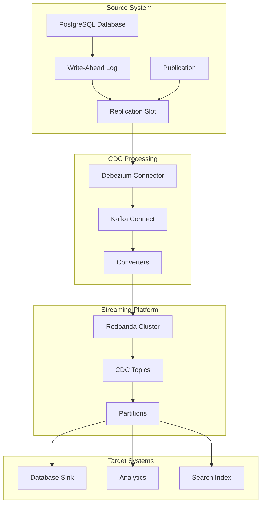

# Architecture Overview

Understanding the CDC pipeline architecture and data flow.

## System Architecture



## Data Flow

### 1. Change Capture
- PostgreSQL writes changes to WAL
- Logical replication slot reads WAL entries
- Publication filters relevant tables

### 2. Processing
- Debezium connector polls replication slot
- Converts database changes to Kafka messages
- Applies transformations and routing

### 3. Streaming
- Messages published to Redpanda topics
- Topic partitioning for scalability
- Message ordering preserved per partition

### 4. Consumption
- Sink connectors consume from topics
- Target systems receive real-time updates
- Error handling and retry mechanisms

## Component Details

### PostgreSQL Configuration
```yaml
# Critical settings for CDC
wal_level: logical
max_replication_slots: 10
max_wal_senders: 10
max_logical_replication_workers: 4
```

### Debezium Connector
- **Type**: Source connector
- **Protocol**: PostgreSQL logical replication
- **Output**: JSON messages with before/after states
- **Delivery**: At-least-once semantics

### Redpanda Cluster
- **Replicas**: 3 nodes for high availability
- **Partitions**: Configurable per topic
- **Retention**: Time and size-based policies
- **Compression**: LZ4 for optimal performance

## Message Format

### CDC Message Structure
```json
{
  "before": {
    "id": 1,
    "name": "Old Product",
    "price": 99.99
  },
  "after": {
    "id": 1,
    "name": "Updated Product", 
    "price": 149.99
  },
  "source": {
    "version": "2.3.0.Final",
    "connector": "postgresql",
    "name": "postgres-cdc",
    "ts_ms": 1721343340123,
    "snapshot": "false",
    "db": "testdb",
    "schema": "public",
    "table": "product",
    "txId": 12345,
    "lsn": 67890
  },
  "op": "u",
  "ts_ms": 1721343340123
}
```

### Operation Types
| Operation | Code | Description |
|-----------|------|-------------|
| Create | `c` | New record inserted |
| Update | `u` | Existing record modified |
| Delete | `d` | Record removed |
| Read | `r` | Initial snapshot read |

## Scalability Patterns

### Horizontal Scaling
- **Kafka Connect**: Multiple worker instances
- **Redpanda**: Add broker nodes
- **PostgreSQL**: Read replicas for queries

### Partitioning Strategy
```yaml
# Topic partitioning by table
cdc.public.users: 3 partitions
cdc.public.orders: 6 partitions  
cdc.public.products: 3 partitions
```

### Performance Optimization
- Batch size tuning
- Compression algorithms
- Memory allocation
- Network optimization

## Fault Tolerance

### High Availability
- **PostgreSQL**: Streaming replication
- **Redpanda**: Multi-replica topics
- **Kafka Connect**: Distributed mode

### Disaster Recovery
- **Backup Strategy**: WAL archiving + snapshots
- **Recovery Point**: Configurable RPO/RTO
- **Failover**: Automated leader election

!!! info "Design Principles"
    - **Exactly-once processing** where possible
    - **Schema evolution** support
    - **Monitoring and observability** built-in
    - **Security by default** with encryption and authentication