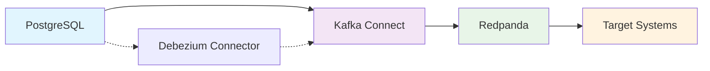

# PostgreSQL CDC with Kafka Connect & Redpanda

A comprehensive Change Data Capture (CDC) solution using PostgreSQL, Debezium, Kafka Connect, and Redpanda for real-time data streaming and replication.

## Overview

This project provides a complete CDC pipeline that captures database changes in real-time and streams them to various target systems through Kafka-compatible messaging.

## Architecture

## Key Features

- **Real-time CDC** - Capture database changes as they happen
- **High Performance** - Redpanda for low-latency streaming
- **Scalable** - Kubernetes-native deployment
- **Secure** - SASL authentication and secret management
- **Production Ready** - Monitoring, alerting, and troubleshooting

## Quick Links

- [Quick Start Guide](getting-started/quick-start.md)
- [Architecture Overview](getting-started/architecture.md)
- [Security Best Practices](security/overview.md)
- [Troubleshooting](operations/troubleshooting.md)

## Components

| Component | Purpose | Technology |
|-----------|---------|------------|
| PostgreSQL | Source database with logical replication | PostgreSQL 16 |
| Kafka Connect | CDC processing and routing | Confluent Platform |
| Redpanda | High-performance streaming | Redpanda |
| Debezium | PostgreSQL CDC connector | Debezium |

!!! tip "Getting Started"
    New to CDC? Start with our [Prerequisites](getting-started/prerequisites.md) and [Quick Start](getting-started/quick-start.md) guides.