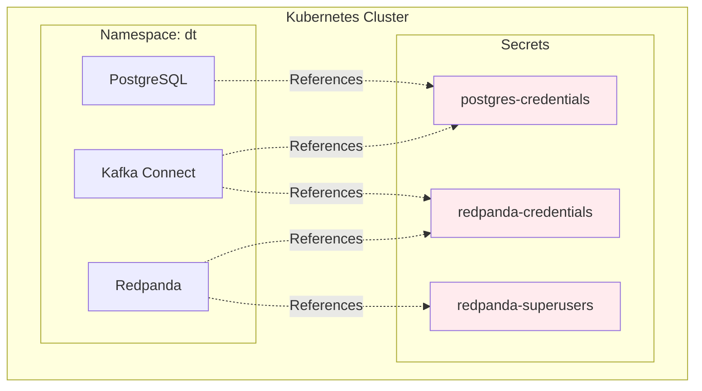

# Security Overview

Security is a critical aspect of any CDC pipeline. This section covers the security measures implemented in this project.

## Security Architecture



## Authentication Methods

### PostgreSQL
- **Primary Authentication**: Username/password via Kubernetes secrets
- **Replication User**: Dedicated user with minimal privileges
- **Connection Security**: MD5 authentication for remote connections

### Redpanda
- **SASL Authentication**: SCRAM-SHA-512 mechanism
- **User Management**: Superuser and application-specific users
- **ACL Control**: Fine-grained access control lists

### Kafka Connect
- **Secret References**: All credentials via Kubernetes secrets
- **Service Account**: Dedicated Kubernetes service account
- **Network Policies**: Restricted inter-pod communication

## Secret Management

### Kubernetes Secrets

All sensitive data is stored in Kubernetes secrets:

| Secret Name | Purpose | Keys |
|-------------|---------|------|
| `postgres-credentials` | PostgreSQL access | `username`, `password`, `database`, `replicator-password` |
| `redpanda-credentials` | Redpanda access | `username`, `password` |
| `redpanda-superusers` | Redpanda user file | `superusers.txt` |

### Secret Generation

Secrets are generated using cryptographically secure random values:

```bash
# Example: Generate 32-byte base64 encoded password
openssl rand -base64 32
```

## Network Security

### Kubernetes Network Policies
- Ingress rules for required communication only
- Egress rules for external dependencies
- Default deny policy for unauthorized traffic

### Service Mesh (Optional)
For production deployments, consider implementing:
- mTLS between services
- Traffic encryption
- Service-to-service authentication

## Best Practices

!!! tip "Security Checklist"
    - [ ] Use generated secrets (never hardcode)
    - [ ] Enable audit logging
    - [ ] Implement network policies
    - [ ] Regular password rotation
    - [ ] Monitor access patterns
    - [ ] Use external secret management in production

!!! warning "Production Considerations"
    - Use external secret management (AWS Secrets Manager, HashiCorp Vault)
    - Enable encryption at rest for etcd
    - Implement certificate-based authentication
    - Set up security scanning and compliance monitoring

## Compliance

This setup supports compliance with:
- **SOC 2**: Audit logging and access controls
- **GDPR**: Data encryption and access management
- **HIPAA**: Encryption and audit trails
- **PCI DSS**: Network segmentation and access controls