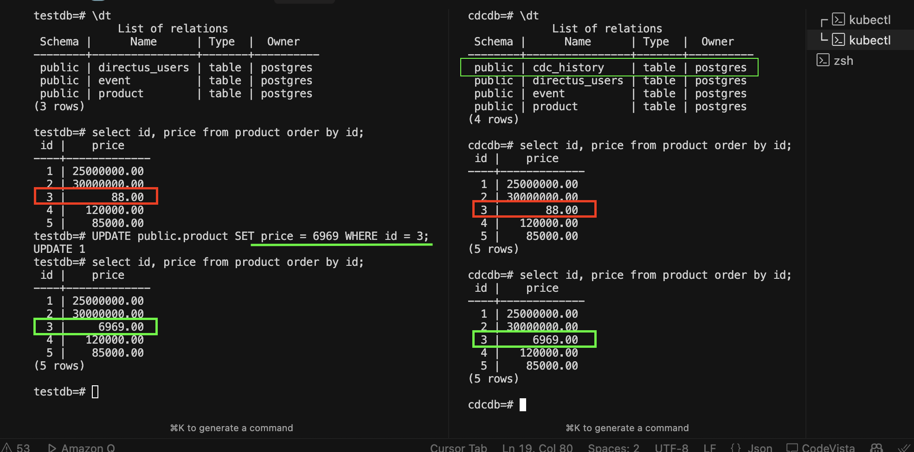

# Kafka Connect

Kafka Connect Helm Chart with automatic connector loading and CDC capabilities.

## ✨ Features

### 🚀 **Automatic Connector Loading**
- Connectors automatically loaded from values.yaml configuration
- No manual port-forwarding and JSON posting required
- GitOps-friendly connector management
- Built-in retry logic and error handling

## 🚀 Quick Start

```bash
# Deploy with auto-loading enabled (default)
helm upgrade --install kafka-connect . -n test-deploy

# Check loaded connectors
kubectl exec -it kafka-connect-xxx -n test-deploy -- curl http://localhost:8083/connectors
```

## Available Connectors

Pre-configured connectors:

- **Debezium PostgreSQL**: Captures change data (CDC) from PostgreSQL databases
- **JDBC Sink CDC**: Replicates raw tables into separate target database  
- **CDC Log**: Stores CDC records in cdc_history table
- ~~**S3 Sink**: Writes data in Parquet format to AWS S3 (deprecated)~~

## Configuration

Connector settings are managed in `values.yaml`:

```yaml
connectors:
  debezium:
    enabled: true
    database:
      hostname: "postgresql.test-deploy.svc.cluster.local"
      user: "postgres"
      password: "password123"
      dbname: "testdb"
    kafka:
      topicPrefix: "cdc"
      serverName: "postgres-cdc"
```

## Docker Image

Pre-built image with plugins:

```yaml
image:
  repository: 079957391273.dkr.ecr.ap-southeast-1.amazonaws.com/aisdph/kafka-connect
  tag: "7.2.2with-plugins-v2"
```

**Available Plugins:**
```json
[
  {
    "class": "io.confluent.connect.jdbc.JdbcSinkConnector",
    "type": "sink",
    "version": "10.8.4"
  },
  {
    "class": "io.confluent.connect.s3.S3SinkConnector",
    "type": "sink",
    "version": "10.6.7"
  },
  {
    "class": "io.confluent.connect.jdbc.JdbcSourceConnector",
    "type": "source",
    "version": "10.8.4"
  },
  {
    "class": "io.confluent.connect.storage.tools.SchemaSourceConnector",
    "type": "source",
    "version": "7.2.2-ccs"
  },
  {
    "class": "io.debezium.connector.postgresql.PostgresConnector",
    "type": "source",
    "version": "2.3.0.Final"
  },
  {
    "class": "org.apache.kafka.connect.mirror.MirrorCheckpointConnector",
    "type": "source",
    "version": "7.2.2-ccs"
  },
  {
    "class": "org.apache.kafka.connect.mirror.MirrorHeartbeatConnector",
    "type": "source",
    "version": "7.2.2-ccs"
  },
  {
    "class": "org.apache.kafka.connect.mirror.MirrorSourceConnector",
    "type": "source",
    "version": "7.2.2-ccs"
  }
]
```

## Architecture

